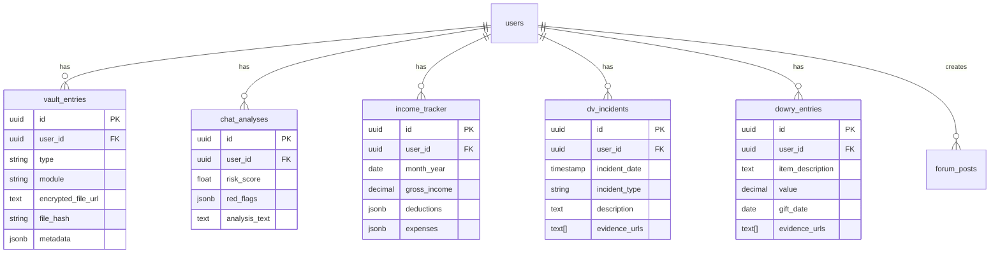

<!-- 31bcc346-f041-4478-9a0b-e11e8eb48fc4 b3bacda0-5818-40dd-b36d-0d08c00221a7 -->
# Blue Drum AI - Complete Development Plan

## Project Overview

**Product:** Blue Drum AI - Evidence-based legal protection platform for Indian men and women

**Tech Stack:** React + TypeScript (Frontend), Express + TypeScript (Backend), Supabase (DB + Storage), Clerk (Auth)

**Target:** Solo developer, flexible timeline focusing on quality

---

## Phase 1: Foundation & MVP (Weeks 1-8)

### 1.1 Project Setup & Infrastructure

**Database Schema** (`supabase/migrations/001_initial_schema.sql`)

- Users table (linked to Clerk)
- Vault entries table (evidence storage)
- Chat analyses table
- Income tracker table
- DV incidents table
- Dowry entries table
- RLS policies for data security

**Backend Setup** (`backend/`)

- Express server with TypeScript
- Clerk authentication middleware
- Supabase client configuration
- Error handling middleware
- API route structure
- Environment configuration

**Frontend Setup** (`frontend/`)

- React + TypeScript + Vite
- Clerk authentication provider
- Supabase client setup
- React Router configuration
- Tailwind CSS + shadcn/ui components
- API client with interceptors

**Storage Setup** (Supabase)

- Create storage buckets: `vault-files`, `chat-exports`, `documents`
- Configure RLS policies for file access
- Set up file upload/download endpoints

### 1.2 Core Authentication & User Management

**Features:**

- Clerk integration (sign up, sign in, OAuth)
- User profile creation in Supabase
- Gender selection (Men/Women/Both)
- Relationship status tracking
- Onboarding flow

**Files:**

- `frontend/src/pages/auth/Login.tsx`
- `frontend/src/pages/auth/Signup.tsx`
- `frontend/src/pages/onboarding/GenderSelection.tsx`
- `backend/src/routes/auth.ts`
- `backend/src/middleware/auth.ts`

### 1.3 Consent Vault (Men's Module - Core)

**Features:**

- File upload (photos, documents, tickets)
- Metadata extraction (EXIF data: date, location)
- Timeline visualization
- File encryption before upload
- Hash generation for verification
- File organization by type/date

**Files:**

- `frontend/src/pages/dashboard/consent-vault/VaultUpload.tsx`
- `frontend/src/pages/dashboard/consent-vault/TimelineView.tsx`
- `frontend/src/components/vault/FileUploader.tsx`
- `frontend/src/lib/encryption/clientEncryption.ts`
- `backend/src/routes/vault.ts`
- `backend/src/services/storage.ts`
- `backend/src/utils/metadataExtractor.ts`

**API Endpoints:**

- `POST /api/vault/upload` - Upload file with metadata
- `GET /api/vault/entries` - Get all vault entries
- `GET /api/vault/entry/:id` - Get specific entry
- `DELETE /api/vault/entry/:id` - Delete entry

### 1.4 Income Tracker (Men's Module)

**Features:**

- Monthly income logging
- Expense categorization (EMI, medical, parents, etc.)
- Disposable income calculator
- Rajnesh v. Neha compliance
- Income affidavit generator (PDF)

**Files:**

- `frontend/src/pages/dashboard/income-tracker/IncomeForm.tsx`
- `frontend/src/pages/dashboard/income-tracker/ExpenseTracker.tsx`
- `frontend/src/pages/dashboard/income-tracker/AffidavitGenerator.tsx`
- `backend/src/routes/income.ts`
- `backend/src/services/affidavitGenerator.ts`

**API Endpoints:**

- `POST /api/income/log` - Log monthly income/expenses
- `GET /api/income/history` - Get income history
- `GET /api/income/disposable` - Calculate disposable income
- `POST /api/income/generate-affidavit` - Generate PDF affidavit

### 1.5 Basic Chat Analyzer (Red Flag Radar - MVP)

**Features:**

- WhatsApp chat export parser (.txt format)
- Basic keyword detection (extortion, threats)
- Risk score calculation (0-100)
- Simple alert system

**Files:**

- `frontend/src/pages/dashboard/red-flag-radar/ChatUpload.tsx`
- `frontend/src/pages/dashboard/red-flag-radar/AnalysisResults.tsx`
- `backend/src/routes/analyze.ts`
- `backend/src/services/ai/chatParser.ts`
- `backend/src/services/ai/riskScorer.ts`

**API Endpoints:**

- `POST /api/analyze/chat` - Analyze chat export
- `GET /api/analyze/history` - Get analysis history

### 1.6 Basic Dashboard

**Features:**

- Overview of all evidence
- Quick stats (files uploaded, risk score, etc.)
- Recent activity feed
- Navigation to modules

**Files:**

- `frontend/src/pages/dashboard/Dashboard.tsx`
- `frontend/src/components/dashboard/StatsCards.tsx`
- `frontend/src/components/dashboard/ActivityFeed.tsx`
- `frontend/src/components/dashboard/ModuleNavigation.tsx`

### 1.7 PDF Export (Lawyer-Ready)

**Features:**

- Export vault entries as organized PDF
- Include metadata and timeline
- Export income affidavit
- Export chat analysis report

**Files:**

- `backend/src/services/pdfGenerator.ts`
- `frontend/src/components/export/ExportButton.tsx`
- `backend/src/routes/export.ts`

**API Endpoints:**

- `POST /api/export/vault` - Export vault as PDF
- `POST /api/export/affidavit` - Export income affidavit
- `POST /api/export/analysis` - Export chat analysis

---

## Phase 2: Women's Module & Enhanced Features (Weeks 9-16)

### 2.1 Dowry Vault (Women's Module)

**Features:**

- Gift documentation (photos, receipts)
- Value tracking
- Transfer evidence (bank transfers, cash)
- Demand recordings (audio/video)
- Witness contact management

**Files:**

- `frontend/src/pages/dashboard/dowry-vault/DowryForm.tsx`
- `frontend/src/pages/dashboard/dowry-vault/GiftTracker.tsx`
- `frontend/src/pages/dashboard/dowry-vault/WitnessManager.tsx`
- `backend/src/routes/dowry.ts`

**API Endpoints:**

- `POST /api/dowry/entry` - Add dowry entry
- `GET /api/dowry/entries` - Get all entries
- `POST /api/dowry/witness` - Add witness
- `GET /api/dowry/summary` - Get dowry summary

### 2.2 Domestic Violence Log (Women's Module)

**Features:**

- Incident documentation with timestamps
- Incident type categorization
- Evidence attachment (photos, videos)
- Medical report organizer
- Police complaint templates

**Files:**

- `frontend/src/pages/dashboard/dv-log/IncidentForm.tsx`
- `frontend/src/pages/dashboard/dv-log/IncidentTimeline.tsx`
- `frontend/src/pages/dashboard/dv-log/MedicalReports.tsx`
- `backend/src/routes/dv.ts`

**API Endpoints:**

- `POST /api/dv/incident` - Log incident
- `GET /api/dv/incidents` - Get all incidents
- `POST /api/dv/medical-report` - Upload medical report
- `POST /api/dv/generate-complaint` - Generate police complaint

### 2.3 Maintenance Calculator (Women's Module)

**Features:**

- Maintenance rights calculator
- Based on husband's income
- Expense documentation (children's education, medical)
- Court filing assistance templates

**Files:**

- `frontend/src/pages/dashboard/maintenance/MaintenanceCalculator.tsx`
- `frontend/src/pages/dashboard/maintenance/ExpenseTracker.tsx`
- `backend/src/services/maintenanceCalculator.ts`

**API Endpoints:**

- `POST /api/maintenance/calculate` - Calculate maintenance
- `POST /api/maintenance/expenses` - Log expenses
- `GET /api/maintenance/rights` - Get maintenance rights info

### 2.4 Enhanced AI Chat Analyzer

**Features:**

- GPT-4 integration for deep analysis
- Pattern detection (extortion, isolation, threats)
- Red flag categorization
- Actionable recommendations
- Historical trend analysis

**Files:**

- `backend/src/services/ai/openaiService.ts`
- `backend/src/services/ai/patternDetector.ts`
- `frontend/src/components/analyzer/RedFlagCard.tsx`
- `frontend/src/components/analyzer/Recommendations.tsx`

**API Updates:**

- Enhanced `POST /api/analyze/chat` with GPT-4
- `GET /api/analyze/trends` - Get risk trends over time

### 2.5 Breakup Generator (Men's Module)

**Features:**

- AI-generated closure messages
- Legally safe templates
- Customization options
- Export as text/PDF

**Files:**

- `frontend/src/pages/dashboard/breakup-generator/MessageGenerator.tsx`
- `backend/src/services/ai/breakupGenerator.ts`
- `backend/src/templates/breakupTemplates.ts`

**API Endpoints:**

- `POST /api/documents/breakup-message` - Generate breakup message
- `GET /api/documents/breakup-templates` - Get templates

---

## Phase 3: Advanced AI & Intelligence (Weeks 17-24)

### 3.1 Social Media Evidence Analyzer

**Features:**

- Instagram/LinkedIn profile analysis
- Income verification from posts
- Lifestyle analysis
- Timeline verification
- Cross-reference with claims

**Files:**

- `frontend/src/pages/dashboard/evidence-analyzer/SocialMediaInput.tsx`
- `frontend/src/pages/dashboard/evidence-analyzer/ComparisonReport.tsx`
- `backend/src/services/ai/socialMediaAnalyzer.ts`
- `backend/src/services/ai/imageAnalysis.ts`

**API Endpoints:**

- `POST /api/analyze/social-media` - Analyze social media profiles
- `POST /api/analyze/income-verification` - Verify income claims
- `POST /api/analyze/timeline` - Verify timeline claims

### 3.2 Case Prediction Engine

**Features:**

- Historical case data analysis
- Outcome prediction based on evidence
- Maintenance amount prediction
- Timeline prediction
- City-specific predictions

**Files:**

- `frontend/src/pages/dashboard/case-prediction/PredictionDashboard.tsx`
- `backend/src/services/ai/casePredictor.ts`
- `backend/src/data/caseDatabase.ts` (seed with public case data)

**API Endpoints:**

- `POST /api/predict/outcome` - Predict case outcome
- `POST /api/predict/maintenance` - Predict maintenance amount
- `POST /api/predict/timeline` - Predict case timeline

### 3.3 Evidence Gap Analyzer

**Features:**

- Compare claims vs. evidence
- Identify missing evidence
- Suggest evidence to collect
- Evidence strength meter

**Files:**

- `frontend/src/pages/dashboard/evidence-analyzer/GapAnalysis.tsx`
- `backend/src/services/ai/gapAnalyzer.ts`

**API Endpoints:**

- `POST /api/analyze/gaps` - Analyze evidence gaps
- `GET /api/analyze/strength` - Get evidence strength score

### 3.4 Advanced Red Flag Detection

**Features:**

- Multi-pattern detection
- Behavioral analysis
- Escalation prediction
- Early warning system

**Files:**

- `backend/src/services/ai/behaviorAnalyzer.ts`
- `frontend/src/components/analyzer/EarlyWarning.tsx`

---

## Phase 4: SOS & Emergency Features (Weeks 25-28)

### 4.1 SOS Panic Button

**Features:**

- One-tap recording activation
- Auto-upload to cloud
- Emergency contact notification
- Location sharing
- Discreet activation

**Files:**

- `frontend/src/components/sos/PanicButton.tsx`
- `frontend/src/pages/dashboard/sos/SOSSettings.tsx`
- `backend/src/routes/sos.ts`
- `backend/src/services/emergencyService.ts`

**API Endpoints:**

- `POST /api/sos/activate` - Activate SOS
- `POST /api/sos/contacts` - Manage emergency contacts
- `GET /api/sos/status` - Get SOS status

### 4.2 Auto-Backup System

**Features:**

- Automatic evidence sync
- Background uploads
- Offline queue
- Sync status tracking

**Files:**

- `frontend/src/lib/sync/autoBackup.ts`
- `frontend/src/hooks/useSync.ts`
- `backend/src/services/syncService.ts`

### 4.3 Emergency Resources

**Features:**

- Helpline directory
- Legal aid resources
- Support services
- Quick access from dashboard

**Files:**

- `frontend/src/components/resources/HelplineDirectory.tsx`
- `frontend/src/pages/resources/Resources.tsx`
- `backend/src/data/resources.ts`

---

## Phase 5: Lawyer Dashboard & Marketplace (Weeks 29-36)

### 5.1 Enhanced Lawyer Dashboard

**Features:**

- Comprehensive case file export
- Evidence organization
- Timeline visualization
- Analysis summaries
- One-click case review

**Files:**

- `frontend/src/pages/lawyer/CaseFileView.tsx`
- `frontend/src/pages/lawyer/EvidenceReview.tsx`
- `backend/src/routes/lawyer.ts`
- `backend/src/services/lawyerDashboard.ts`

**API Endpoints:**

- `POST /api/lawyer/export-case` - Export complete case file
- `GET /api/lawyer/case-summary` - Get case summary
- `POST /api/lawyer/review` - Submit lawyer review

### 5.2 Lawyer Directory

**Features:**

- Verified lawyer listings
- Specialization filters
- Location-based search
- Ratings and reviews
- Consultation booking

**Files:**

- `frontend/src/pages/lawyer/Directory.tsx`
- `frontend/src/pages/lawyer/LawyerProfile.tsx`
- `frontend/src/pages/lawyer/Booking.tsx`
- `backend/src/routes/lawyer-directory.ts`

**API Endpoints:**

- `GET /api/lawyers` - Get lawyer listings
- `GET /api/lawyers/:id` - Get lawyer details
- `POST /api/lawyers/:id/book` - Book consultation

### 5.3 Lawyer Verification System

**Features:**

- Bar council verification
- Document upload
- Admin approval workflow
- Verification badges

**Files:**

- `backend/src/routes/lawyer-verification.ts`
- `backend/src/services/verificationService.ts`

---

## Phase 6: Community & Growth Features (Weeks 37-44)

### 6.1 Legal News Feed

**Features:**

- Curated legal updates
- Case law summaries
- Legal reform updates
- Personalized content

**Files:**

- `frontend/src/pages/news/NewsFeed.tsx`
- `frontend/src/components/news/NewsCard.tsx`
- `backend/src/routes/news.ts`
- `backend/src/services/newsAggregator.ts`

**API Endpoints:**

- `GET /api/news` - Get news feed
- `GET /api/news/:id` - Get article details
- `POST /api/news/preferences` - Update preferences

### 6.2 Community Forum (Moderated)

**Features:**

- Anonymous posting
- Topic categories
- Moderation system
- Success stories section
- Q&A with experts

**Files:**

- `frontend/src/pages/community/Forum.tsx`
- `frontend/src/pages/community/PostDetail.tsx`
- `frontend/src/pages/community/CreatePost.tsx`
- `backend/src/routes/community.ts`
- `backend/src/services/moderationService.ts`

**Database:**

- `forum_posts` table
- `forum_comments` table
- `forum_moderation` table

**API Endpoints:**

- `GET /api/forum/posts` - Get posts
- `POST /api/forum/posts` - Create post
- `POST /api/forum/posts/:id/comments` - Add comment
- `POST /api/forum/moderate` - Moderate content (admin)

### 6.3 Educational Content Library

**Features:**

- Video tutorials
- Legal guides
- Webinar recordings
- Resource downloads
- Progress tracking

**Files:**

- `frontend/src/pages/education/Library.tsx`
- `frontend/src/pages/education/VideoPlayer.tsx`
- `frontend/src/pages/education/Guides.tsx`
- `backend/src/routes/education.ts`

**API Endpoints:**

- `GET /api/education/videos` - Get video library
- `GET /api/education/guides` - Get guides
- `POST /api/education/progress` - Track progress

### 6.4 Progress Tracking & Gamification

**Features:**

- Evidence completeness score
- Action items checklist
- Milestone badges
- Achievement system
- Streak tracking

**Files:**

- `frontend/src/components/progress/CompletenessMeter.tsx`
- `frontend/src/components/progress/ActionItems.tsx`
- `frontend/src/components/progress/Badges.tsx`
- `backend/src/services/progressTracker.ts`

**API Endpoints:**

- `GET /api/progress/score` - Get completeness score
- `GET /api/progress/actions` - Get action items
- `GET /api/progress/badges` - Get user badges

### 6.5 Smart Reminders System

**Features:**

- Evidence upload reminders
- Legal deadline tracker
- Document expiry alerts
- Follow-up reminders
- Email/SMS notifications

**Files:**

- `frontend/src/components/reminders/ReminderList.tsx`
- `backend/src/services/reminderService.ts`
- `backend/src/jobs/scheduledReminders.ts`

**API Endpoints:**

- `GET /api/reminders` - Get reminders
- `POST /api/reminders` - Create reminder
- `PUT /api/reminders/:id` - Update reminder

---

## Phase 7: Advanced Integrations (Weeks 45-52)

### 7.1 WhatsApp Integration

**Features:**

- Direct chat import
- Auto-backup bot
- Real-time monitoring
- Secure chat storage

**Files:**

- `backend/src/services/whatsapp/integration.ts`
- `backend/src/services/whatsapp/bot.ts`
- `frontend/src/components/integrations/WhatsAppConnect.tsx`

**API Endpoints:**

- `POST /api/integrations/whatsapp/connect` - Connect WhatsApp
- `POST /api/integrations/whatsapp/import` - Import chats
- `GET /api/integrations/whatsapp/status` - Get connection status

### 7.2 Calendar Integration

**Features:**

- Court date tracking
- Evidence date reminders
- Meeting scheduler
- Legal deadline calendar

**Files:**

- `frontend/src/components/calendar/CalendarView.tsx`
- `backend/src/services/calendarService.ts`

### 7.3 Email Integration

**Features:**

- Forward legal notices
- Auto-extract evidence
- Email templates
- Secure storage

**Files:**

- `backend/src/services/email/integration.ts`
- `frontend/src/components/integrations/EmailConnect.tsx`

### 7.4 Multi-Language Support

**Features:**

- Hindi, English, regional languages
- Voice input
- Translated templates
- Regional legal context

**Files:**

- `frontend/src/i18n/` - Translation files
- `frontend/src/components/i18n/LanguageSelector.tsx`
- `backend/src/services/translation.ts`

---

## Phase 8: Mobile App & Advanced Features (Weeks 53-60)

### 8.1 Mobile App (React Native)

**Features:**

- Native iOS/Android app
- Offline mode
- Quick capture
- Push notifications
- Wearable integration

**Files:**

- `mobile/` - React Native project
- `mobile/src/screens/` - App screens
- `mobile/src/services/` - Mobile services

### 8.2 Advanced Security Features

**Features:**

- Document verification
- Blockchain timestamps
- Location verification
- Metadata integrity checks

**Files:**

- `backend/src/services/verification/documentVerifier.ts`
- `backend/src/services/blockchain/timestampService.ts`

### 8.3 Abuse Detection & Prevention

**Features:**

- Abuse pattern detection
- Resource recommendations
- Helpline integration
- Safety checks

**Files:**

- `backend/src/services/safety/abuseDetector.ts`
- `frontend/src/components/safety/SafetyResources.tsx`

---

## Technical Architecture

### Database Schema Overview

### API Architecture

### File Upload Flow

---

## Implementation Priorities

### Critical Path (Must Have for Launch)

1. Phase 1: Foundation & MVP (Weeks 1-8)
2. Phase 2: Women's Module Core (Weeks 9-12)
3. Phase 5.1: Lawyer Dashboard Export (Week 29)

### High Value Features

- Phase 2.4: Enhanced AI Chat Analyzer
- Phase 3.1: Social Media Analyzer
- Phase 4.1: SOS Panic Button

### Growth Features

- Phase 6.1: Legal News Feed
- Phase 6.2: Community Forum
- Phase 5.2: Lawyer Directory

---

## Success Metrics

### Phase 1 Completion

- [ ] 100+ waitlist signups
- [ ] MVP deployed and functional
- [ ] Core features working (Vault, Income Tracker, Chat Analyzer)

### Phase 2 Completion

- [ ] Women's module fully functional
- [ ] 50+ paying users
- [ ] Positive user feedback

### Phase 3 Completion

- [ ] AI features operational
- [ ] Case prediction accuracy >70%
- [ ] 200+ active users

---

## Risk Mitigation

### Technical Risks

- **File Storage Costs**: Implement compression and cleanup policies
- **AI API Costs**: Cache responses, use cheaper models where possible
- **Scalability**: Plan for horizontal scaling early

### Legal Risks

- **Disclaimer**: Add clear "not legal advice" disclaimers everywhere
- **Data Privacy**: Implement zero-knowledge encryption
- **Compliance**: GDPR/Indian data protection compliance

### Business Risks

- **User Acquisition**: Focus on organic growth initially
- **Retention**: Build habit-forming features (reminders, progress tracking)
- **Monetization**: Start with freemium, add premium features gradually

---

## Next Steps

1. **Week 1**: Set up project structure, database schema, basic auth
2. **Week 2-3**: Implement Consent Vault (file upload, encryption, storage)
3. **Week 4**: Build Income Tracker and basic dashboard
4. **Week 5-6**: Implement Chat Analyzer (basic version)
5. **Week 7**: PDF Export functionality
6. **Week 8**: Testing, bug fixes, MVP launch preparation

### To-dos

- [ ] Set up project structure: frontend (React+TS), backend (Express+TS), Supabase database schema with RLS policies, Clerk auth integration
- [ ] Build Consent Vault: file upload with client-side encryption, metadata extraction (EXIF), timeline visualization, Supabase storage integration
- [ ] Implement Income Tracker: monthly logging, expense categorization, disposable income calculator, Rajnesh v. Neha compliant affidavit generator
- [ ] Build basic Chat Analyzer: WhatsApp export parser, keyword detection, risk scoring (0-100), alert system
- [ ] Create basic Dashboard: overview stats, recent activity feed, navigation to modules, evidence summary
- [ ] Implement PDF Export: vault entries export, income affidavit export, chat analysis report, lawyer-ready formatting
- [ ] Build Women's Dowry Vault: gift documentation, value tracking, transfer evidence, demand recordings, witness management
- [ ] Implement Women's DV Log: incident documentation, categorization, evidence attachment, medical reports, police complaint templates
- [ ] Build Maintenance Calculator: rights calculator based on husband's income, expense documentation, court filing templates
- [ ] Enhance Chat Analyzer with GPT-4: deep pattern detection, red flag categorization, actionable recommendations, trend analysis
- [ ] Build Breakup Generator: AI-generated legally safe closure messages, customizable templates, export functionality
- [ ] Implement Social Media Evidence Analyzer: Instagram/LinkedIn analysis, income verification, lifestyle analysis, timeline verification
- [ ] Build Case Prediction Engine: outcome prediction, maintenance amount prediction, timeline prediction, city-specific data
- [ ] Implement SOS Panic Button: one-tap recording, auto-upload, emergency contacts, location sharing, discreet activation
- [ ] Build Lawyer Dashboard: comprehensive case file export, evidence organization, timeline visualization, one-click review
- [ ] Create Lawyer Directory: verified listings, specialization filters, location search, ratings, consultation booking
- [ ] Build Legal News Feed: curated updates, case law summaries, legal reform updates, personalized content
- [ ] Implement Community Forum: anonymous posting, moderation system, success stories, Q&A with experts
- [ ] Build Progress Tracking: evidence completeness score, action items checklist, milestone badges, achievement system
- [ ] Implement WhatsApp Integration: direct chat import, auto-backup bot, real-time monitoring, secure storage